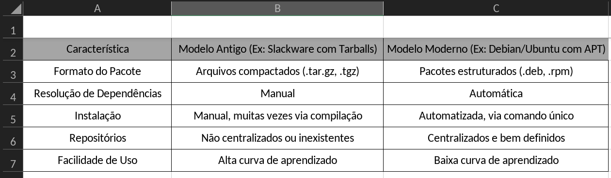

# Gerenciadores de Pacotes no Linux: Uma Jornada da Complexidade à Simplicidade

Se você utiliza Linux hoje, a instalação de um novo software é uma tarefa trivial, frequentemente resumida a um único comando no terminal. No entanto, essa facilidade é o resultado de uma evolução significativa. Este artigo explora a história, a funcionalidade e a importância dos gerenciadores de pacotes, revelando como eles transformaram a experiência do usuário no ecossistema Linux.

## A Era Pré-Gerenciadores Modernos: O Desafio do Slackware

Nos primórdios do Linux, distribuições como o Slackware, uma das mais antigas e respeitadas, exigiam um processo de instalação de software consideravelmente mais complexo e manual. O usuário era responsável por:

*   **Instalação Física:** Utilizar múltiplos CDs ou até disquetes para carregar os componentes do sistema.
*   **Configuração Manual de Dependências:** Identificar e instalar manualmente todas as bibliotecas e programas auxiliares (dependências) que um software necessitava para funcionar. Este cenário era frequentemente referido como "Dependency Hell" (Inferno das Dependências), onde a falta de uma dependência ou a presença de uma versão incompatível poderia inviabilizar a instalação ou o funcionamento de um programa [1].
*   **Manuseio de Arquivos Compactados:** Trabalhar diretamente com arquivos `.tar.gz` (tarballs), que continham o código-fonte ou binários pré-compilados, exigindo compilação manual em muitos casos.

Este modelo demandava um conhecimento técnico aprofundado e um tempo considerável, sem qualquer automação para simplificar o processo. A gestão de software era uma tarefa artesanal, dependente inteiramente da perícia do usuário.

## O Que São Gerenciadores de Pacotes?

Com a crescente complexidade dos sistemas operacionais e a proliferação de softwares, tornou-se imperativo automatizar o processo de gestão de programas. Foi nesse contexto que os gerenciadores de pacotes emergiram como soluções cruciais. Em sua essência, um gerenciador de pacotes é uma coleção de ferramentas de software que automatiza o processo de instalação, atualização, configuração e remoção de pacotes de software em um sistema operacional de computador [2].

Suas principais responsabilidades incluem:

*   **Busca em Repositórios:** Localizar softwares em vastos bancos de dados online, conhecidos como repositórios.
*   **Download e Instalação:** Baixar os pacotes de software e instalá-los no sistema de forma organizada.
*   **Resolução Automática de Dependências:** Identificar, baixar e instalar automaticamente todas as dependências necessárias para que um programa funcione corretamente, eliminando o "Dependency Hell".
*   **Atualização e Remoção:** Gerenciar o ciclo de vida do software, permitindo atualizações seguras e a remoção limpa de programas e suas dependências.

Em suma, os gerenciadores de pacotes transformaram a gestão de software de uma tarefa manual e propensa a erros em um processo eficiente e automatizado.

## O Papel Central dos Gerenciadores no Linux Moderno

Hoje, o gerenciamento de pacotes é, sem dúvida, o **coração pulsante do Linux moderno**. Quase todas as interações com software no sistema operacional passam por eles. Sua importância se manifesta em diversas frentes:

*   **Instalação de Aplicações:** Desde um navegador web até ferramentas de desenvolvimento, tudo é instalado de forma padronizada.
*   **Manutenção do Sistema:** Atualizações de segurança e de funcionalidades são distribuídas e aplicadas de maneira centralizada, garantindo a estabilidade e a proteção do sistema.
*   **Correção de Vulnerabilidades:** A capacidade de aplicar patches de segurança rapidamente é vital, e os gerenciadores de pacotes facilitam esse processo.
*   **Gestão de Bibliotecas e Componentes:** Asseguram que todas as bibliotecas e componentes do sistema estejam em suas versões corretas e compatíveis.

Sem a eficiência e a organização proporcionadas pelos gerenciadores de pacotes, o Linux seria um sistema muito mais desafiador de usar e manter, reminiscente dos seus dias mais primitivos.

## Evolução: Dos Tarballs ao APT e Além

A transição do modelo manual para os gerenciadores de pacotes modernos representa um salto gigantesco na usabilidade do Linux. A tabela a seguir ilustra as principais diferenças:

Essa evolução permitiu que a instalação de um sistema completo, que antes levava horas ou até dias, fosse reduzida para menos de uma hora, democratizando o acesso e o uso do Linux.

## Principais Gerenciadores de Pacotes no Ecossistema Linux

O universo Linux é vasto e diversificado, e cada grande distribuição tende a adotar seu próprio gerenciador de pacotes, refletindo suas filosofias de design e comunidades. Embora todos compartilhem o objetivo fundamental de instalar, atualizar e remover software, eles o fazem com implementações e abordagens distintas [3].

Alguns dos mais proeminentes incluem:

*   **APT (Advanced Package Tool):** Utilizado por distribuições baseadas em Debian, como Ubuntu, Mint e o próprio Debian. É conhecido por sua robustez e vasta quantidade de pacotes disponíveis.
*   **DNF (Dandified YUM) / YUM (Yellowdog Updater Modified):** Predominantes em distribuições baseadas em Red Hat, como Fedora, CentOS e RHEL. O DNF é a versão mais moderna e aprimorada do YUM.
*   **Pacman:** O gerenciador de pacotes do Arch Linux e seus derivados. É elogiado por sua simplicidade, velocidade e capacidade de gerenciar pacotes de forma eficiente.
*   **Zypper:** O gerenciador de pacotes do openSUSE, conhecido por suas poderosas funcionalidades de gerenciamento de repositórios e resolução de dependências.
*   **Portage:** Exclusivo do Gentoo Linux, é um sistema baseado em código-fonte que oferece controle granular sobre a compilação e otimização de software.
*   **APK (Alpine Package Keeper):** Utilizado pelo Alpine Linux, uma distribuição leve e focada em segurança, ideal para contêineres.

## Repositórios: A "App Store" do Linux

Os gerenciadores de pacotes operam em conjunto com os **repositórios**, que podem ser imaginados como as "lojas de aplicativos" do mundo Linux. São servidores que hospedam milhares de pacotes de software, prontos para serem baixados e instalados. Diferentemente do modelo Windows, onde o download de programas frequentemente ocorre de sites diversos, o Linux centraliza a distribuição de software através de repositórios, o que confere vantagens significativas [4]:

*   **Segurança Aprimorada:** Todos os pacotes nos repositórios oficiais são verificados e assinados digitalmente, minimizando o risco de software malicioso.
*   **Facilidade de Atualização:** As atualizações de segurança e de recursos são disponibilizadas centralmente, permitindo que os usuários mantenham seus sistemas atualizados com um único comando.
*   **Consistência do Sistema:** Garante que todas as partes do sistema operacional e os softwares instalados sejam compatíveis entre si, evitando conflitos e instabilidades.

Essa abordagem centralizada é um pilar fundamental da segurança e estabilidade do Linux.

## Mais Importante que a Ferramenta: O Conceito por Trás

Um ponto crucial, frequentemente destacado por especialistas, é que a compreensão dos **mecanismos subjacentes ao funcionamento dos pacotes** é mais valiosa do que apenas saber usar os comandos de um gerenciador moderno [5]. Entender conceitos como:

*   **O que é uma dependência e por que ela existe?**
*   **Como os arquivos são organizados no sistema de arquivos após a instalação de um pacote?**
*   **Qual o processo de construção (build) e instalação de um software a partir do código-fonte?**

Esse conhecimento aprofundado não apenas auxilia na resolução de problemas complexos, mas também proporciona uma compreensão mais rica e completa do sistema operacional como um todo. Permite ao usuário ir além da mera execução de comandos, capacitando-o a diagnosticar e solucionar questões de forma autônoma.

## Conclusão

Os gerenciadores de pacotes representam uma das inovações mais impactantes no desenvolvimento do Linux. Eles transformaram a experiência de uso de um processo manual, complexo e demorado para um modelo simples, rápido e altamente automatizado. Mais do que meras ferramentas, eles são um dos pilares que conferem ao Linux sua reputação de sistema operacional poderoso, eficiente e seguro.

Para aqueles que desejam aprofundar seu entendimento e apreciar a engenharia por trás da simplicidade moderna, a **dica final** é experimentar distribuições mais "raiz" como Slackware ou Arch Linux. Essa imersão pode oferecer uma perspectiva valiosa sobre o que realmente acontece nos bastidores dos comandos que usamos diariamente.

## Referências

[1]: https://plus.diolinux.com.br/t/o-que-e-um-gerenciador-de-pacotes/36704?utm_source=chatgpt.com "O que é um gerenciador de pacotes? - Diolinux Feed - Diolinux Plus"
[2]: https://pt.wikipedia.org/wiki/Gerenciador_de_pacotes "Gerenciador de pacotes - Wikipédia"
[3]: https://sempreupdate.com.br/comparativo-gerenciadores-de-pacotes-linux/?utm_source=chatgpt.com "Comparativo definitivo de gerenciadores de pacotes no Linux: DNF, APT, Pacman e Zypper"
[4]: https://maisgeek.com/como-os-gerenciadores-de-pacotes-e-instalacao-de-software-funcionam-no-linux/?utm_source=chatgpt.com "▷ Como os gerenciadores de pacotes e instalação de software funcionam no Linux - Mais Geek"
[5]: https://videohighlight.com/v/iQkBbRPkASo?aiFormatted=false&language=pt-BR&mediaType=youtube&summaryId=73Dw4YkBYn5DH8zt6Dhx&summaryType=default&utm_source=chatgpt.com "Entendendo Pacotes com Slackware | Deb, Apt, Tarbals | YouTube Video Summary – Video Highlight | Video Highlight"
